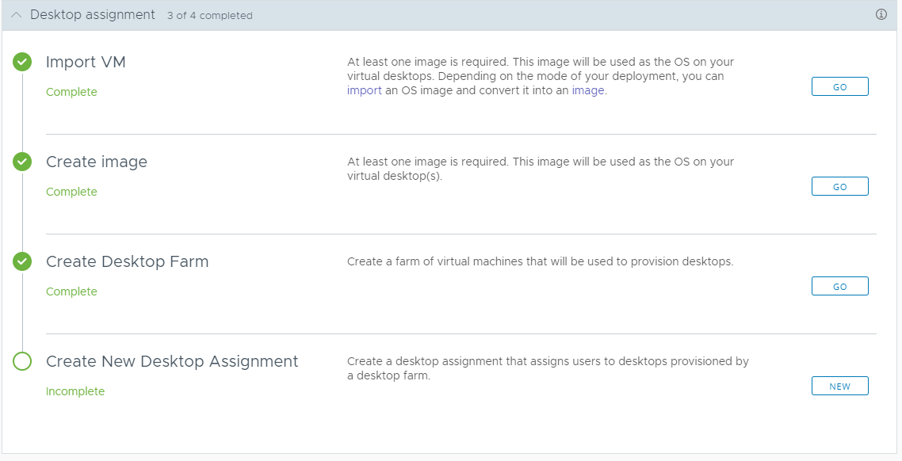
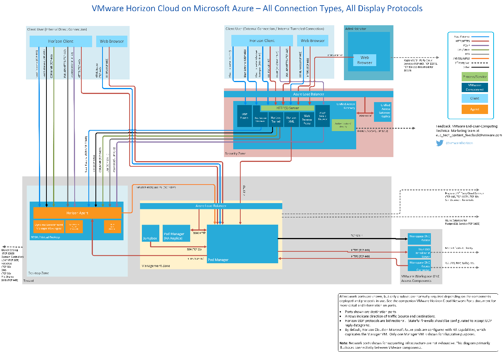

Purpose
=======

The purpose of this guide is to setup and deploy Horizon Cloud on Azure
using WVD to rapidly enable our customers to provide work from home
desktops via Windows 10 Enterprise Virtual Desktop.

This guide does not cover application group provisioning of specific on
integration with profile management, such as FSLogix, which is
extensively documented.

Pre-Requisites and Important Considerations 
===========================================

1.  Begin by reviewing the prerequisites and requirements document
    [here](https://docs.vmware.com/en/VMware-Horizon-Cloud-Service/services/hzncloudmsazure.getstarted15/GUID-5F69086E-E061-48F3-93D9-9705B8B5FD8A.html)

2.  Important Azure considerations prior to deployment:

> **Important:** Before launching the pod deployment wizard and starting
> to deploy your pod, in addition to the requirements below, you must be
> aware of the following key points:

a.  No Microsoft Azure Policies or Policy Definition configured in the
    Microsoft Azure environment block, deny, or restrict creation of the
    pod\'s components. As an example, you and your IT team must verify
    that none of your Microsoft Azure Policies block, deny, or restrict
    creation of components on Azure storage account. For information
    about Azure Policies, see the [[Azure Policy
    documentation]{.underline}](https://docs.microsoft.com/en-us/azure/governance/policy/).

b.  The pod deployer requires that your Azure storage account allow for
    the deployer to use the Azure StorageV1 account type. Ensure that
    your Microsoft Azure Policies do not restrict or deny the creation
    of content requiring the Azure StorageV1 account type.

c.  As part of the pod and gateway deployment processes, Horizon
    Cloud creates resource groups (RGs) in your Microsoft Azure
    subscription that do not have tags on them, including the initial
    resource group that is created for the temporary jump box that
    orchestrates those deployment processes. Pod deployment will fail if
    you try to deploy a pod into a Microsoft Azure subscription that has
    any type of resource tag requirement at the time of deployment, or
    at the time of pod upgrades or adding a gateway configuration to a
    pod.\
    \
    You must verify that your Microsoft Azure Policies allows creation
    of the pod\'s untagged resource groups in the target subscription.
    For the list of RGs that the deployer creates, see the
    Administration Guide\'s [Resource Groups Created For a Pod Deployed
    In Microsoft Azure]{.underline} topic.

d.  All cloud-connected pods must have line-of-sight to the same set of
    Active Directory domains at the time you deploy those pods.

During a typical deployment, you can expect the following resources to be deployed:
-----------------------------------------------------------------------------------

Minimum Microsoft Azure capacity available for Horizon
Cloud infrastructure in addition to the expected desktop and app
workload. Note that as long as this capacity is made available, Horizon
Cloud will automatically deploy these VMs and no manual installation is
required.

-   Pod Deployment Engine, also known as the Jump Box (transient) --- 1
    x Standard\_F2

-   Pod/Pod Manager with High Availability enabled --- 2 x
    Standard\_D4\_v3 (if no Standard\_D4\_v3 in the region, 2 x
    Standard\_D3\_v2)

-   Pod/Pod Manager without High Availability enabled --- 1 x
    Standard\_D4\_v3 (if no Standard\_D4\_v3 in the region, 1 x
    Standard\_D3\_v2)

-   Microsoft Azure Database for PostgreSQL Service --- Generation 5,
    Memory Optimized, 2 vCores, 10 GB Storage

-   External Unified Access Gateway (optional) --- 2 x Standard\_A4\_v2

-   Internal Unified Access Gateway (optional) --- 2 x Standard\_A4\_v2


Requirements for deployment
---------------------------

1.  Three non-overlapping address ranges in CIDR format in the pod\'s
    VNet, reserved for subnets.

-   Management subnet --- /27 minimum

-   Tenant subnet --- /27 minimum /24 - /22 preferred, based on the
    number of desktops and RDS servers

-   DMZ subnet --- /28 minimum when Unified Access Gateway is deployed
    in the pod\'s VNet (optional)

> *Subnets can either be created manually on the VNet or by Horizon
> Cloud during deployment. If using manually created subnets, no other
> resources can be attached.*

2.  NTP server or servers available and accessible from the Horizon
    Cloud pod and Unified Access Gateway instances.

3.  Configure the VNet (Virtual Network) DNS server, pointing to a valid
    DNS server that can resolve both internal machine names and external
    names.

4.  Outbound internet access on the VNet to specific DNS names that must
    be resolvable and reachable using specific ports and protocols.

5.  FQDN for external and or internal user access (Required when
    deploying a pod with Unified Access Gateway).

6.  Certificate or certificates for Unified Access Gateway in PEM format
    matching the FQDN 

7.  Service principal and authentication key created for each
    subscription with contributor role assigned on the subscription.

8.  Required resource providers registered in each Microsoft Azure
    subscription. See step 8.b in Create the Required Service Principal
    Needed by the Horizon Cloud Pod Deployer by Creating an Application
    Registration.
    
    

Architecture Overview
=====================

In a typical deployment of HCoA, these are the components:


Begin Deployment
================

1.  Log into the Horizon Cloud Portal:

    a.  [VMware Horizon
        portal](https://cloud.horizon.vmware.com/login2/login?redirect_uri=%2Fhorizonadmin%2F%23%2Flogin)

    b.  *If you do not have an account, signup*
        *[here](https://www.vmware.com/horizon-cloud-on-microsoft-azure-trial.html)
        for a 45 day trial*

2.  After logging in successfully, you will receive the following
    screen:


Add Capacity
============

1.  Select the ADD button to the right, and you will be prompted to
    select the cloud -- (Please) Select Azure


2.  Next, you'll be prompted for your subscription details, Azure AD
    Tenant ID and the application ID that you setup in the
    prerequisites. Complete all fields and click ADD.


3.  Complete the POD setup fields:


4.  Complete the UAG Setup. Refer to
    [here](https://docs.vmware.com/en/VMware-Horizon-Cloud-Service/services/hzncloudmsazure.getstarted15/GUID-97521A2A-689A-4D05-9123-E020E967E679.html)
    for more informatio on UAG deployment considerations.

**The certificate has to be in PEM format**


5.  After you complete these fields, you will see a summary of
    information. Click submit to proceed with the deployment. This phase
    will take approx. 10-15 minutes.

6.  After the Azure POD is successfully created, move onto configure
    Active Directory. Click on configure beside Active Directory in the
    main window. Complete the fields. Note, you should have your DNS
    properly setup on your vNet prior to this step.


7.  Once the domain bind is successful, you will be prompted for a
    Domain Join Account. This account is for joining your provisioned
    Windows Systems to your domain. This account should have the
    following privileges:

> Domain join account

a.  Active Directory domain join account which can be used by the system
    to perform Sysprep operations and join computers to the domain,
    typically a new account (domain join user account)

b.  Is a member of the Horizon Cloud Administrators Group

c.  Set account password to Never Expire

d.  This account requires the following Active Directory permissions:
    List Contents, Read All Properties, Read Permissions, Reset
    Password, Create Computer Objects, Delete Computer Objects.

e.  This account also requires the Active Directory permission named
    Write All Properties on all descendant objects of the target
    Organizational Unit (OU) that you plan to use for farms and VDI
    desktop assignments.

f.  For additional details and requirements, see [Service Accounts That
    Horizon Cloud Requires for Its Operations]{.underline}


8.  Add the Horizon Administrator Group:

> Active Directory groups

-   Horizon Cloud Administrators --- Active Directory security group
    > for Horizon Cloud administrators. Contains the Horizon
    > Cloud administrative users and domain join account. This group is
    > added to the Super Administrators role in Horizon Cloud.


9.  At this point you should have completed the General Setup stage, and
    have a screen as follows:


Desktop Assignment
==================

1.  This phase of the deployment completes the following tasks:

    a.  Imports a VM

    b.  Allows for preparation & customization of the image

    c.  Creation of an image for your VDI/RDSH systems

    d.  Creates a Desktop farm for your PODs/Users to consume

2.  On Import VM, click ADD to begin


3.  You will have the option to Import a Virtual Machine or Import a
    Windows OS Virtual Machine from the marketplace, which will
    automatically be configured with the Horizon Cloud Agents.


To creating Desktop Images for a Horizon Cloud Pod in Microsoft Azure,
see:

<https://docs.vmware.com/en/VMware-Horizon-Cloud-Service/services/hzncloudmsazure.admin15/GUID-D090D2ED-6446-4544-BEEC-D01F60F1F62B.html>

4.  For this deployment, I will select an image from the Marketplace.


a.  Select an OS -- I have selected Windows 10 Multisession 1909 with
    Office

b.  Options for GPU (if available in your selected region)

c.  Domain Join -- Select this option if it is your finalized image for
    Pod Deployment only.

d.  Enable Public IP -- for RDP access to machine for customizations.

e.  Optimize Windows Image -- details
    [here](https://docs.vmware.com/en/VMware-Horizon-Cloud-Service/services/hzncloudmsazure.admin15/GUID-B6C49A99-0A72-418C-87DD-5C7751E7C951.html)

f.  Admin Credentials for the VM, Create the admin username that will be
    used for the local admin account to access the VM\'s operating
    system, and also used during the convert to image process. This
    username can be a maximum of 15 characters in length, cannot end in
    a full stop (\".\") and cannot be a username that is not permitted
    in Microsoft Azure, like \"guest\" or \"administrator\".

g.  Properties - Give a unique name to the desktop that will be used to
    create an image. This image will be used as the operating system on
    the virtual desktops.

h.  Here is a list of Windows OS Images available as of writing this:

> 


i.  Here is a list of the advanced options that you can enable:

> 


5.  Once the import process has completed, you can click Go to proceed
    with image customization.


6.  You should now be presented with an imported VM with an agent status
    of Active. If its not active, select the VM and from the MORE menu,
    select "Reset Agent Pairing"


7.  At this point now, you can login to this imported VM and begin your
    customizations. When you have completed your customizations, return
    to the main deployment menu (Settings \> Getting Started). Leave the
    machine powered on, as the next step (Create Image) requires the VM
    to be powered on.

8.  The next step is the Create an image. Click on Create Image \> New


9.  Complete the required fields for the new image.


10. Click Publish when complete. This process can take up to 10 minutes.

11. You can monitor the status of these tasks and jobs by going to
    Monitor \> Activity


12. Create Desktop Farm -- Create a farm of virtual machines that will
    be used to provision desktops.


13. Select New on Create Desktop Farm, you will be presented with the
    following:


a.  Name: A friendly name for the farm and provide a description.

b.  VM Names: This is where you can provide a naming convention for your
    VMs which will be numerically incremented. Try to keep this under 15
    characters.

c.  Farm Type: Select application or Desktops.

d.  Filter Models: This allows you to filter for a specific VM type. I
    have selected a B series for reduced costs.

e.  The next few options are pre-completed for you, please read
    [this](https://docs.vmware.com/en/VMware-Horizon-7/7.5/horizon-architecture-planning/GUID-CFAABEB9-9CF2-4098-A01D-1CA118D4B6BD.html)
    if you are not familiar with VMware's Display Protocols

f.  Complete the remaining fields.

```{=html}
<!-- -->
```
14. Management, setting the maintenance and timeout handling on the
    farm
    

15. Click next to see a summary and submit to create the farm. This step
    can take up to 30 minutes.

16. The final step is to assign users to the desktop farm. Select New to
    continue.




17. Assign Desktops. There are three options to consider:

    a.  **Dedicated**:

Persistent VDI desktop experience which is mapped to a single user.
    
   b.  **Floating**:

> Non-Persistent VDI desktop experience which multiple users can use at
> different times (i.e. resets after each user session).

   c.  **Session**:

> Non-persistent RDSH published desktop experience shared across
> multiple users (i.e. terminal services).

For this document, I'm selecting Session using Windows 10 Multisession,
which is similar to RDSH


18. Select your Active Directory User Group and click next and submit.


19. At this point now, the deployment of Horizon should be completed for
    you.


Connect to your Horizon Desktops
================================

20. From your Horizon Cloud Console, go to Settings \> Capacity and
    click on the Pod you created. Scroll down to the bottom and you
    should see your Gateway Settings


21. From this screen, you can see the Public and private IP addresses
    for your Gateways. You can create an A Record on your public DNS to
    point to your Public IP Address. The FQDN for the DNS name should
    match that of your SSL certificate.

22. Connect to the public address of your UAG Gateway and you should get
    a login screen:


23. From this screen, login with the Active Directory Credentials of the
    group that you have assigned to this desktop farm. You can also
    select to download the Horizon Client for Windows.

24. After successful login, you can now see a list of your entitled
    desktops (and applications)


25. You should now be connected to your desktop


26. Integration of FSLogix profile management would be recommended and
    well documented
    [here](https://docs.microsoft.com/en-us/fslogix/install-ht)

27. Horizon Cloud on Azure also provides entitlement to Dynamic
    Environment Manager (DEM). More information on this can be found
    [here](https://docs.vmware.com/en/VMware-Dynamic-Environment-Manager/index.html)

Resources
=========

All connection types and display protocols: (link
[here](https://techzone.vmware.com/resource/vmware-horizon-cloud-service-microsoft-azure-network-ports-diagrams#client_connections_for_horizon))


=======================================================================================================================================================

VMware Workspace ONE and VMware Horizon Reference Architecture
==============================================================

<https://techzone.vmware.com/resource/workspace-one-and-horizon-reference-architecture#executive_summary>

QuickStart Guide for Horizon on Azure:
======================================

<https://techzone.vmware.com/quick-start-tutorial-vmware-horizon-cloud-service-microsoft-azure#241579>

Technical Insights about Horizon Cloud on Microsoft Azure
=========================================================

<https://blogs.vmware.com/euc/2017/10/technical-insights-about-horizon-cloud-on-microsoft-azure.html>

Horizon Cloud on Microsoft Azure -- FAQ
=======================================

<https://www.vmware.com/content/dam/digitalmarketing/vmware/en/pdf/cloud-services/vmware-horizon-cloud-on-azure-faq.pdf>
